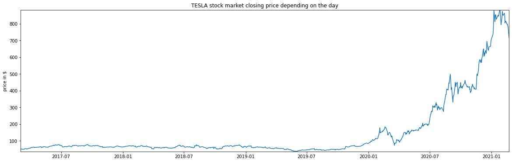
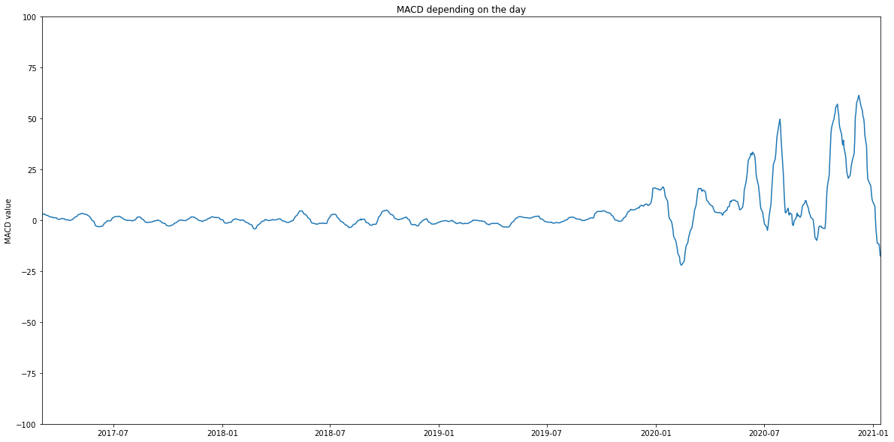
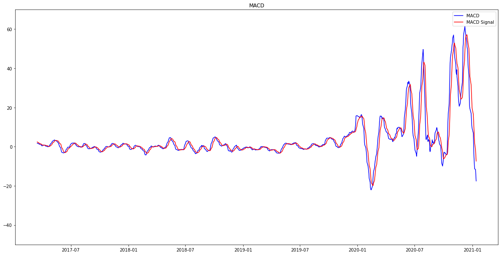
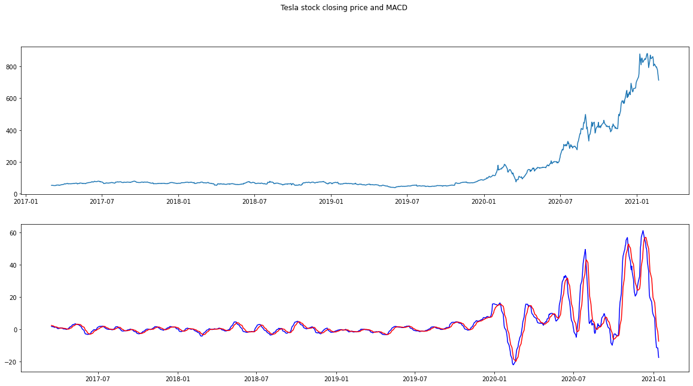
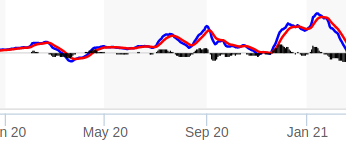

# MACD - Moving Average Convergence Divergence
Project for a numerical methods class. MACD marker (used for a stock analysis) in Python.

Technologies used:
-Python
-Anaconda
-Jupyter Notebook
-Pandas library
-NumPy library

Results:

and real Tesla MACD from Market Watch:

which is the same MACD plot but slightly differs due to x axis scaling.